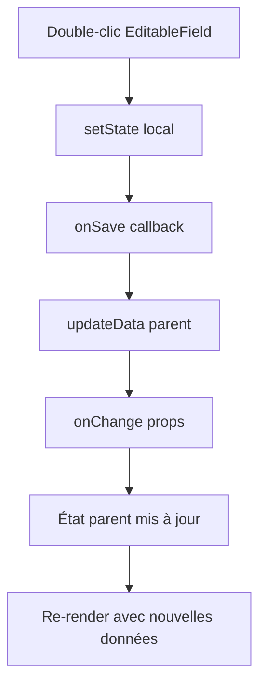

# Architecture - QuoteEditor

## 🏗️ Vue d'ensemble

QuoteEditor suit une architecture modulaire basée sur des principes de **composition**, **séparation des responsabilités** et **réutilisabilité**.

```
QuoteEditor/
├── QuoteEditor.tsx           # Composant principal + toolbar
├── components/               # Composants UI spécialisés
│   ├── QuotePage/           # Page de devis complète
│   ├── QuoteSection/        # Sections tableaux
│   ├── OptionBlock/         # Blocs personnalisables
│   ├── EditableField/       # Champ éditable universel
│   ├── InstructionsFrame/   # Encart signature
│   ├── SignatureSection/    # Signature finale
│   └── shared/              # Composants réutilisables
├── hooks/                   # Logique métier
├── entities/                # Types TypeScript
├── pdf/                     # Génération PDF
├── utils/                   # Utilitaires
├── mocks/                   # Données de test
└── styles/                  # Styles SCSS
```

## 🎯 Principes de design

### 1. Composition over Inheritance
```tsx
// ✅ Composition - flexible et testable
<QuotePage>
  <QuoteHeader />
  <QuoteRecipient />
  <QuoteSections />
  <OptionBlocks />
  <QuoteFooter />
</QuotePage>

// ❌ Évité - héritage complexe
class QuotePage extends BaseDocument extends EditableDocument
```

### 2. Single Responsibility Principle
Chaque composant a une responsabilité unique :

- **QuoteEditor** : Orchestration globale + toolbar
- **EditableField** : Édition de texte universel
- **OptionBlock** : Logique d'un bloc personnalisable
- **BlocksContainer** : Layout et drag & drop des blocs
- **usePDFExport** : Génération PDF exclusivement

### 3. Unidirectional Data Flow
```
[Parent State] 
    ↓ props
[QuoteEditor] 
    ↓ data
[QuotePage] 
    ↓ sections
[QuoteSection] 
    ↑ callbacks
[Parent State]
```

## 🧩 Composants principaux

### QuoteEditor (Orchestrateur)

```tsx
// Responsabilités :
// - État global des données
// - Historique undo/redo
// - Auto-sauvegarde
// - Toolbar et actions globales
// - Export PDF

const QuoteEditor: React.FC<QuoteEditorProps> = ({
  data, onChange, onSave, autoSave, readonly
}) => {
  const {
    data: currentData,
    updateData,
    canUndo, canRedo,
    undo, redo,
    saveState
  } = useQuoteEditor(data, onChange, onSave, autoSave);
  
  return (
    <>
      <Toolbar />
      <QuotePage data={currentData} onUpdateData={updateData} />
    </>
  );
};
```

### QuotePage (Mise en page)

```tsx
// Responsabilités :
// - Layout général A4
// - Distribution des sections de contenu
// - Application du thème de couleur
// - Configuration des pages

const QuotePage: React.FC = ({ data, onUpdateData, contentConfig, readonly }) => {
  const { applyColorVariables } = useColorTheme(data.company);
  
  return (
    <div className="page" style={colorVariables}>
      <QuotePageHeader />
      <QuotePageRecipient />
      <QuotePageIntro />
      <QuoteSections />
      <QuotePageTotals />
      <BlocksContainer />
      <QuotePageFooter />
    </div>
  );
};
```

### EditableField (Cœur d'édition)

```tsx
// Responsabilités :
// - Édition inline universelle
// - Validation de saisie
// - États d'édition (hover, focus, disabled)
// - Support multiline et types de données

const EditableField: React.FC = ({
  value, onSave, placeholder, multiline, className, disabled, as, fullWidth
}) => {
  const [isEditing, setIsEditing] = useState(false);
  const [editValue, setEditValue] = useState(value);
  
  // Double-clic → mode édition
  // Enter/Escape → validation/annulation
  // Blur → auto-validation
};
```

## 🔄 Flux de données

### 1. Modification locale



### 2. Auto-sauvegarde

```tsx
// useQuoteEditor.ts
useEffect(() => {
  if (autoSave && onSave && hasUnsavedChanges) {
    const timer = setTimeout(() => {
      saveData();
    }, 1000); // Debounce 1s
    
    return () => clearTimeout(timer);
  }
}, [data, autoSave, onSave]);
```

### 3. Historique undo/redo

```tsx
// Implémentation stack d'historique
const addToHistory = (newData: QuoteData) => {
  // Supprimer le futur si on n'est pas à la fin
  if (historyIndex < history.length - 1) {
    history = history.slice(0, historyIndex + 1);
  }
  
  history.push(newData);
  historyIndex = history.length - 1;
  
  // Limiter à 50 états
  if (history.length > 50) {
    history = history.slice(-50);
    historyIndex = 49;
  }
};
```

## 🎨 Système de thème

### Variables CSS dynamiques

```scss
:root {
  --dynamic-primary-color: #0066cc;        // Couleur principale
  --dynamic-primary-contrast: white;       // Contraste auto
  --dynamic-primary-light: rgba(0,102,204,0.1);    // Version claire
  --dynamic-primary-lighter: rgba(0,102,204,0.05); // Version très claire
  --dynamic-primary-dark: #004499;         // Version foncée
}
```

### Hook useColorTheme

```tsx
export const useColorTheme = (company: Company) => {
  const colorVariables = useMemo(() => {
    return generateColorVariables(company.mainColor);
  }, [company.mainColor]);

  const applyColorVariables = (element = document.documentElement) => {
    Object.entries(colorVariables).forEach(([prop, value]) => {
      element.style.setProperty(prop, value);
    });
  };

  return { colorVariables, applyColorVariables };
};
```

## 📄 Architecture PDF

### Séparation HTML/PDF

```
components/               # Composants HTML/CSS
├── QuotePage/           # Version éditable
└── ...

pdf/                     # Composants PDF équivalents
├── components/
│   ├── PDFHeader/       # Version PDF du header
│   ├── PDFRecipient/    # Version PDF du destinataire
│   └── ...
├── styles/              # Styles React-PDF
└── QuotePDFDocument.tsx # Document PDF principal
```

### Avantages de cette approche

1. **Fidélité** : Rendu PDF identique à l'éditeur
2. **Performance** : Pas de conversion DOM → PDF
3. **Contrôle** : Gestion précise de la pagination
4. **Maintenance** : Styles partagés via utilitaires

### Génération PDF

```tsx
// usePDFExport.tsx
const exportToPDF = async (data: QuoteData): Promise<void> => {
  // 1. Générer le document React-PDF
  const doc = <QuotePDFDocument data={data} />;
  
  // 2. Convertir en Blob
  const blob = await pdf(doc).toBlob();
  
  // 3. Télécharger
  const url = URL.createObjectURL(blob);
  const link = document.createElement('a');
  link.href = url;
  link.download = `devis-${data.quote.number}.pdf`;
  link.click();
  URL.revokeObjectURL(url);
};
```

## 🧪 Hooks personnalisés

### useQuoteEditor (Hook principal)

```tsx
export const useQuoteEditor = (
  initialData: QuoteData,
  onChange: (data: QuoteData) => void,
  onSave?: (data: QuoteData) => Promise<void>,
  autoSave: boolean = true
) => {
  // État des données
  const [data, setData] = useState<QuoteData>(initialData);
  
  // État d'édition
  const [editingState, setEditingState] = useState<EditingState>();
  
  // État de sauvegarde
  const [saveState, setSaveState] = useState<SaveState>();
  
  // Historique pour undo/redo
  const historyRef = useRef<HistoryState[]>([]);
  const historyIndexRef = useRef<number>(0);
  
  // Auto-sauvegarde
  const autoSaveTimerRef = useRef<NodeJS.Timeout>();
  
  // Gestion des raccourcis clavier
  useEffect(() => {
    const handleKeyDown = (e: KeyboardEvent) => {
      if ((e.ctrlKey || e.metaKey) && e.key === 'z') {
        e.preventDefault();
        undo();
      }
      // ...
    };
    
    document.addEventListener('keydown', handleKeyDown);
    return () => document.removeEventListener('keydown', handleKeyDown);
  }, []);
  
  return {
    data, updateData,
    editingState, startEditing, stopEditing,
    saveState, saveData,
    canUndo, canRedo, undo, redo
  };
};
```

### useListManager (Gestion listes)

```tsx
// Hook réutilisable pour add/remove/reorder d'éléments
export const useListManager = <T>(
  items: T[],
  onUpdate: (newItems: T[]) => void
) => {
  const addItem = (newItem: T) => {
    onUpdate([...items, newItem]);
  };
  
  const removeItem = (index: number) => {
    onUpdate(items.filter((_, i) => i !== index));
  };
  
  const reorderItems = (fromIndex: number, toIndex: number) => {
    const newItems = [...items];
    const [draggedItem] = newItems.splice(fromIndex, 1);
    newItems.splice(toIndex, 0, draggedItem);
    onUpdate(newItems);
  };
  
  return { addItem, removeItem, reorderItems };
};
```

### useDragAndDrop (Drag & Drop)

```tsx
export const useDragAndDrop = (enabled: boolean = true) => {
  const handleDragStart = (e: React.DragEvent, index: number, type: string) => {
    e.dataTransfer.setData('text/plain', JSON.stringify({ index, type }));
    e.currentTarget.classList.add('dragging');
  };
  
  const handleDrop = (e: React.DragEvent, dropIndex: number, onReorder: Function) => {
    e.preventDefault();
    const dragData = JSON.parse(e.dataTransfer.getData('text/plain'));
    onReorder(dragData.index, dropIndex);
  };
  
  return { handleDragStart, handleDrop, /* ... */ };
};
```

## 🔧 Patterns de performance

### 1. Mémorisation des rendus coûteux

```tsx
const QuoteSection = React.memo(({ section, onUpdateSection }) => {
  // Re-render uniquement si section change
}, (prevProps, nextProps) => {
  return prevProps.section === nextProps.section;
});
```

### 2. Debounce des saisies

```tsx
const EditableField = ({ value, onSave }) => {
  const debouncedSave = useMemo(
    () => debounce(onSave, 300),
    [onSave]
  );
  
  const handleChange = (newValue: string) => {
    setLocalValue(newValue);
    debouncedSave(newValue);
  };
};
```

### 3. Lazy loading des composants PDF

```tsx
const PDFExport = React.lazy(() => import('./pdf/QuotePDFDocument'));

// Chargement à la demande lors de l'export
const exportPDF = async () => {
  const { QuotePDFDocument } = await import('./pdf/QuotePDFDocument');
  // ...
};
```

## 🧩 Extensibilité

### Ajout de nouveaux types de blocs

```tsx
// 1. Étendre le type OptionBlock
interface CustomBlock extends OptionBlock {
  type: 'custom';
  customData: any;
}

// 2. Créer le composant
const CustomBlockComponent: React.FC<{ block: CustomBlock }> = ({ block }) => {
  return <div>Custom content</div>;
};

// 3. Étendre le renderer
const OptionBlock: React.FC = ({ block }) => {
  if (block.type === 'custom') {
    return <CustomBlockComponent block={block as CustomBlock} />;
  }
  // Logique existante...
};
```

### Ajout de nouveaux hooks

```tsx
// hooks/useValidation.ts
export const useValidation = (data: QuoteData) => {
  const [errors, setErrors] = useState<ValidationError[]>([]);
  
  useEffect(() => {
    const validationErrors = validateQuoteData(data);
    setErrors(validationErrors);
  }, [data]);
  
  return { errors, isValid: errors.length === 0 };
};
```

## 🏆 Avantages de cette architecture

1. **Modulaire** : Chaque composant est indépendant et testable
2. **Réutilisable** : EditableField, useListManager, etc. sont génériques
3. **Performant** : Mémorisation et optimisations ciblées
4. **Maintenable** : Séparation claire des responsabilités
5. **Extensible** : Facile d'ajouter de nouveaux types de contenu
6. **Type-safe** : TypeScript strict sur toute la base de code
7. **Cohérent** : Patterns répétés pour une API prévisible